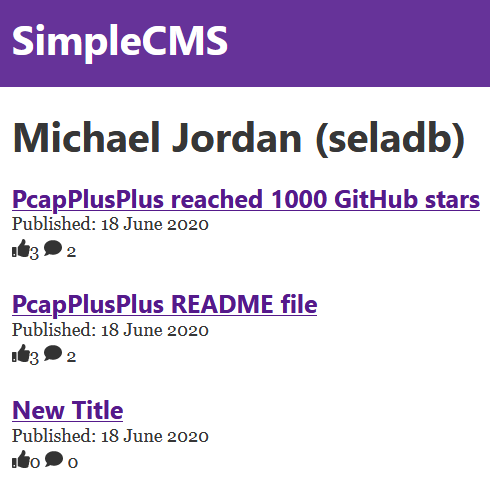

# Gatsby Frontend for SimpleCMS

SimpleCMSWeb is a simple frontend built with [Gatsby](https://www.gatsbyjs.org) that queries data from the Django server using GraphQL and creates web pages for displaying blog posts, user data, likes and comments.

## Installation

Please refer to the guide in the [main README page](https://github.com/seladb/SimpleCMS).

## Screenshots

### The Main Page Shows all Blog Posts:

Displays basic information about all blog posts including title, published date, writer, number of likes and comments

### Blog Post Page:

Displays the blog post itself including title, content, published date, number of likes, comments

### User Page:

Displays all blog post for a particular user

